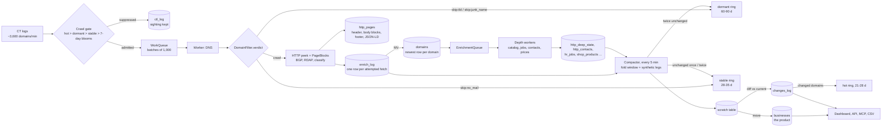

# Architecture

> Table names are the data model v2 names (2026-10-01). Sections dated
> before that mention the old ones; read them with this mapping:
> `domains_history` is now `enrich_log`, `domains_current` is `domains`,
> `biz_enrichment` / `biz_enrichment_log` are `http_deep_state` /
> `http_deep_log`, `biz_contact` is `http_contacts`, `biz_career` is
> `hr_jobs`, `biz_signal` is `changes_log`, `ctl_sightings` is `ctl_log`.

ListSignal discovers newly-certificated domains from Certificate Transparency
logs, enriches them across a distributed worker fleet, and serves the result
as a searchable directory of businesses (Shopify stores, SaaS, agencies, …).

```
                        ┌──────────────── MASTER (ls-master) ────────────────┐
CT logs (~16, both protocols)▶│ CTL.Poller ─▶ Cluster.WorkQueue (ETS, capped, TTL) │
                        │        ▲                 │ dequeue (batches)       │
                        │ Recrawl.Scheduler ───────┘                         │
                        │                                                    │
                        │ Cluster.Inserter ─▶ ClickHouse (enrich_log,        │
                        │   ▲ (quality guard)      domains MV, http_pages)  │
                        │   │                       ▲                        │
                        │ LSWeb (Phoenix) ──────────┘  SQLite (users/plans)  │
                        └───┼────────────────────────────────────────────────┘
                            │ rows                     Erlang distribution
                            │                          over WireGuard mesh
        ┌───────────────────┴─────────────────────────────────┐
        │            WORKERS (14 nodes, LS_ROLE=worker)       │
        │  Cluster.WorkerAgent: pulls a batch, runs stages:   │
        │   DNS ─▶ verdict ─▶ [HTTP ∥ BGP ∥ RDAP] ─▶ classify ─▶ merge │
        │   (filtered domains: no row, verdict back to the gate)       │
        └─────────────────────────────────────────────────────┘
```

## The pipeline end to end (2026-10-01)



**How a compiled row is merged.** The fold reads every crawl of a touched
domain in the pass window plus two synthetic legs built from the current
compiled row (one "verified" leg carrying the page facts as observed at
`http_last_seen_at`, one "latest" leg carrying status and errors as of
`http_last_checked_at`). Each column has one rule from the spec:

| Rule | Columns | Meaning |
|---|---|---|
| newest observed | title, meta, tech, apps, language, pages, phone, address, fingerprint, ETag, simhash | the newest crawl that actually saw the site (2xx/3xx, not a bot wall) |
| newest non-empty | DNS, RDAP, BGP, ranks, country evidence | a blank never replaces a value |
| union | emails, social links, subdomains | lists only grow, capped |
| best | revenue, employees, model, industry | highest confidence wins, ranks seen on the master |
| newest, excluding 304 (planned) | http_status | a conditional GET is a check, not a status |
| derived | `estimated_realness`, `dns_tech`, `dns_email_provider`, `estimated_junk` | computed from the merged row (parking nameservers override the page verdict) |

The merged row lands in a scratch table; `changes_log` is written from the
scratch-vs-current diff with one rule per tracked column (set added/removed,
changed, started/stopped, down/back, percentage); then the rows move into
`businesses`. `docs/data-model-standards.md` holds the rules in detail.

**How revisit frequency follows relevance.** Every domain starts on the
7-day blooms. A crawl that comes back unchanged puts it on 28-35 days; a
second unchanged crawl puts it on 60-90 days; a recorded change (anything
but subdomain churn) puts it back on 7 days for a month. Domains the name
settles (unlisted TLD, junk name, registry) sleep 60-90 days without a row;
a listed TLD without mail setup waits a month and is re-evaluated. The
recrawl scheduler's weekly tier for digital businesses stays as the floor
for domains the certificate logs never re-sight.

## Node roles

One OTP codebase, role-selected at boot by `LS_ROLE` (see `LS.Application`):

| Role | Runs | Where |
|---|---|---|
| `master` | `LS.CTL.Poller`, `LS.Cluster.WorkQueue`, `LS.Cluster.Inserter`, `LS.Cluster.Monitor`, `LS.Recrawl.Scheduler`, `LS.Cluster.Compactor`, `LS.Verification.Scheduler`, `LS.Ops.Sentinel`, Phoenix web | ls-master (also hosts ClickHouse + SQLite) |
| `worker` | `LS.Cluster.WorkerAgent` + resolvers/caches | 13 nodes (see `devops/listsignal/fleet.conf` for the roster + lanes); names derived at boot as `worker_<host>@<wg0-ip>` |
| `standalone` | both | local dev (`make dev`) |

Nodes form a mesh over WireGuard (`10.0.0.0/24`); workers connect to
`master@10.0.0.1` via Erlang distribution and everything cluster-side is
plain `GenServer.call/cast` across nodes — there is no HTTP API between nodes.

## The work loop

1. **Discovery** — `LS.CTL.Poller` tails every CT log Chrome lists as
   ingestible — RFC-6962 logs via `get-entries` and Static-CT-API logs
   (Let's Encrypt and newer operators) via CDN data tiles. The source list is
   derived from Chrome's log list at boot and re-reconciled every 6h
   (`LS.CTL.Sources`): new logs are picked up and retired ones dropped
   automatically, with an email describing each change (a persistent
   `LogList.diff_current/0` drift alert is the backstop — non-empty means the
   reconcile loop itself is broken). `LS.CTL.Wire` parses BOTH entry types —
   precerts included, which most CAs (LE among them) exclusively log — and
   every SAN in each certificate, then filters obvious junk and enqueues
   `%{ctl_domain: d, source: :ctl}` items.
2. **Queueing** — `LS.Cluster.WorkQueue` is a bounded in-memory queue
   (ETS, 3M cap, 24h TTL). When full, `enqueue/1` returns `:queue_full` and
   the item is dropped — inflow shedding is deliberate.
3. **Pulling** — each `LS.Cluster.WorkerAgent` requests batches (default
   1000 domains) from the master. In-flight batches are tracked; a batch not
   completed within 10 minutes is requeued (worker died).
4. **Enrichment** — per batch, on the worker:
   - **DNS** (`LS.DNS.Resolver`) — A/AAAA/MX/TXT/CNAME via *pinned* local
     Unbound. Runs for every domain.
   - **HTTP** (`LS.HTTP.Client` + detectors) — only for domains passing
     `LS.HTTP.DomainFilter` (Tranco-ranked, or high-value TLD + MX + SPF +
     not-junk). Fetches the homepage (and select secondary pages), extracts
     title/tech/apps/language/schema, classifies business model & industry
     (`LS.ML.Classifier`, sentence embeddings).
   - **BGP** (`LS.BGP.Resolver`) — IP → ASN/org/country via Team Cymru whois.
   - **RDAP** (`LS.RDAP.Client`) — registrar & domain dates, rate-limited
     per registry.
   Stages run concurrently per batch (`Task.async_stream`); one stage
   failing or timing out never kills the batch.
5. **Merge** — `LS.Pipeline.merge_row/8` flattens all stage output into one
   55-column row (single source of truth for row shape).
6. **Insert** — rows are cast to `LS.Cluster.Inserter` on the master, which
   buffers (5s / 5000 rows), applies a per-worker **quality guard**
   (a worker whose rows stop carrying enrichment gets quarantined — see the
   h1 case study), and bulk-inserts into ClickHouse.

## Storage

| Store | What | Notes |
|---|---|---|
| ClickHouse `ls.enrich_log` | append-only log, one row per enrichment pass (was domains_history) | 365-day TTL; the worker's internal column names |
| ClickHouse `ls.domains` | `ReplacingMergeTree(enriched_at)` MV keyed on domain (was domains_current) | every domain ever crawled, newest row wins |
| ClickHouse `ls.businesses` | the product table, one row per real business, data model v2 names (`LS.Schema.Columns`) | compiled every 5 min by the compactor; `ReplacingMergeTree(compiled_at)` |
| ClickHouse `ls.http_pages` | the page as the product keeps it: header, ordered body blocks, footer, JSON-LD, per (domain, page kind) | latest version only; ZSTD; written by workers, never read by the compactor |
| ClickHouse `ls.changes_log` | one row per change of one tracked column on one business (was biz_signal) | keyed (field, value, changed_at, domain) with a per-domain projection; 730-day TTL |
| ClickHouse `ls.tech_catalog` | mirror of `LS.Tech.Catalog`: the closed list of published tech names with category and ecosystem | synced on master boot |
| ClickHouse `ls.http_deep_log` / `http_deep_state` | the deep pass: append-only log and current row per domain (were biz_enrichment_log / biz_enrichment) | |
| ClickHouse `ls.shop_products`, `shop_collections`, `hr_jobs`, `http_contacts`, `http_deep_prices`, `news_items` | current-state child tables, one row per key (were biz_*) | the explorer's detail panel reads them by primary key |
| ClickHouse `ls.ctl_log` | suppressed certificate sightings (was ctl_sightings) | 90-day TTL |
| ClickHouse `ls.domains_fast` | view over `domains` exposing the materialized `country`, `is_shopify` | public SEO pages |
| ClickHouse `ls.tech_index` | one row per (technology, titled domain), `ORDER BY (tech, rank, domain)` | what `/tech`, `/top`, `/compare`, the directory and the sitemap read; SEO only |
| ClickHouse `ls.daily_*` | SummingMergeTree daily aggregates | kept forever; feed dashboards |
| ClickHouse `ls.verified_facts` / `verified_log` / `verified_runs` | pipeline 3: facts per (domain, fact, source), the persisted source archive, the run log | |
| SQLite (`LS.Repo`) | users, plans, Stripe state | the only critical durable state; hourly backups |

**Newest-row-wins is a sharp edge**: a worker writing *hollow* rows silently
replaces good data. That's what the Inserter guard protects against.

**Data model v2 (2026-10-01).** The product table is declared once, in
`LS.Schema.Columns`: name, type, fold rule, signal rule, legacy name, API
surface, meaning. From that one list come the CREATE TABLE, the compactor's
INSERT and SELECT, the v1 transform, the `changes_log` detection, the API
JSON, the CSV and the data dictionary on /developers. Naming: prefix is the
producing pipeline (`http_`, `http_deep_`, `dns_`, `ctl_`, `rdap_`, `bgp_`,
`shop_`, `hr_`, `news_`), `estimated_` for anything a rule or model produced
(with `_confidence` and `_evidence`), `verified_` for a registry fact; no
`_source` anywhere. Lists are Arrays; `http_tech` carries platforms, vendors,
WordPress plugins and Shopify apps together, filtered through the catalog.
The enrichment log keeps the worker's internal names; the spec's `select`
expression is the bridge. The full decision record is
`docs/data-model-standards.md`; the migration is `clickhouse/migrations/025_data_model_v2.sh`.

Accuracy of what these tables *say* (classification, revenue, junk detection)
is measured against a hand-labeled golden set — see
[data-quality.md](data-quality.md).

## Verification (pipeline 3)

Discovery finds, Enrichment reads, **Verification proves**: authoritative
sources are ingested on the master and their facts attached to domains we
already hold. Code under `LS.Verification.*`; design and rules in that
module's docs.

```
 Wikidata SPARQL ─┐                                  verification_runs      (dated fetch log)
 YC Algolia ──────┤  LS.Verification.Scheduler       verified_source_records (every parsed record, matched or not)
 SEC EDGAR bulk ──┼─▶ one source at a time ─▶ tiers ─▶ verified_facts        (domain, fact, source) newest wins
 Companies House ─┤  (master, plain HTTP,      │                │
 Sirene + INPI ───┘   our UA, ≥1 s per host)   │                └─▶ Compactor ─▶ businesses.verified_*
                                               │                                 (source precedence, never recency)
                        website URL → registrable domain → exact row in domains_current   = 'website'
                        legal name key + country → UNIQUE label in businesses (both sides) = 'name_country'
```

- **Two match tiers, nothing fuzzy.** A wrong "verified" link is worse than
  none, so the name tier is precision-first and expected to match a minority;
  its per-source rate (`LS.Verification.match_report/0`) is what decides
  whether an LLM-assisted linker over the persisted unmatched records is
  worth building.
- **`businesses` gets new sparse columns only** — `verified_revenue`,
  `verified_revenue_source`, `verified_employees`, `verified_employees_source`,
  `mission_summary`. `estimated_*` keeps its writer and meaning. Readers
  (explorer, store page, lookup, CSV) show verified when present, else the
  estimate; explorer filters match the shown value.
- **Precedence** — revenue `sec_edgar > companies_house > inpi > wikidata`,
  employees `wikidata > sirene > companies_house > yc`.
- **Bounded memory by construction**: archives are streamed (`unzip -p` port,
  `:zip.foldl`), inserts go in 5 000-row chunks, the name-tier lookup table
  is rebuilt in 16 hash shards, and the compactor's verified join is scoped
  to the slice like every other join.
- Every run is logged with URL, snapshot, byte and record counts and matches
  per tier; downloaded snapshots live under `/home/ls/verification/<source>/<date>/`.

## The 7-day gate and certificate sightings (2026-09-06)

`LS.Cluster.CrawlDedup` keeps eight daily bloom windows (10M entries each,
~96MB): a domain enqueued from a CT log is crawled at most once every 7 days
and released by day 8. The recrawl scheduler bypasses the gate
(`WorkQueue.enqueue(data, force: true)`) because it is the schedule. Since
2026-10-03 the scheduler resolves its due list on the master first
(`LS.Recrawl.Liveness`): a name that no longer resolves gets a check
recorded as a full copy of its newest `domains` row with `http_error`
'dns_unresolved', and only live names go to the workers, where a refresh
item is fetched without the first-contact name filter. Without this the
dead names, which never advance their last check, took over the
oldest-first due list and the refresh budget. A
suppressed sighting is appended to `ctl_sightings` (issuer, subdomains,
90-day TTL) instead of being dropped, never to `domains_history`, whose
newest-row-wins projection would blank the domain's other columns.

### The stable ring: change-aware revisits (2026-09-09)

Measured on prod over 45 days (2% of domains): 73.9% of crawls in a week
are revisits, and 88.9% of revisits at least 7 days apart return the same
title, technologies, apps and status. After each compaction pass the
compactor asks `LS.Clickhouse.stable_domains/2` which touched domains came
back unchanged (observed 2xx/3xx crawls only, top-100K excluded) and
`CrawlDedup.mark_stable/1` writes them into a second ring of five weekly
blooms (20M entries each at 0.1% FP, ~180MB). `WorkQueue.enqueue/2` checks
`CrawlDedup.stable?/1` first, and `force: true` does not bypass it: a
stable domain's schedule is 28-35 days, and the recrawl scheduler is only
the 7-day schedule. The first crawl after release decides again. The ring
is saved to `LS.State.dir/0` every six hours and on shutdown, and rotated
forward by the weeks a restart took. `LS_STABLE_REVISIT=false` turns the
gate off. Expected effect at steady state: about half of all fetches
skipped, which is what lets the fleet shrink to about seven fetch IPs;
the 09-11 worker count decision reads `WorkQueue.stats.total_deduped_stable`
against `total_enqueued`.

### Dormant and hot rings, and no hollow rows (2026-10-01)

Measured that morning: 345M of the 506M rows in `enrich_log` were domains
that resolved and were then filtered (TLD, name, no MX+SPF), never fetched;
189M of the 305M rows in `domains` are the same class, and 64.5% of the
domains the CT logs re-sight in 30 days are those domains coming back to be
filtered again. Three changes in `WorkerAgent`, `WorkQueue` and
`CrawlDedup`:

- A filtered or unresolved domain writes **no row**. The worker returns the
  verdicts with the batch (`WorkQueue.complete/3`), and
  `WorkQueue.remember_skipped/1` puts name-settled skips (`{:skip, :tld}`,
  `{:skip, :junk_name}`, registry TLDs) into the **dormant ring** (three
  monthly blooms, 40M at 2%, so 60-90 days) and mail-less skips
  (`{:skip, :no_mail}`) into the stable ring (28-35 days, mail often comes
  weeks after the certificate). `DomainFilter.verdict/4` is the rule, with
  two bypasses measured in the never-fetched class: a Shopify, Wix or
  Squarespace edge address (18M domains) and MX at a known business mail
  provider without SPF (19M).
- A business unchanged across a gap of 25+ days was already unchanged once
  (nothing recrawls a stable domain sooner): `Compactor.mark_stable/2`
  puts it in the dormant ring instead of the stable one.
- Domains with a change recorded in the pass (subdomain churn excluded) go
  into the **hot ring** (four weekly blooms, 5M at 1%, 21-28 days) which
  `WorkQueue.enqueue/2` checks first: a hot domain ignores both slow rings.

Gate order: hot > dormant > stable > daily blooms. Rings share one
rotation/save/restore implementation in `CrawlDedup` (`@rings`);
`LS_DORMANT_RING=false` turns the dormant check off. The public "domains
checked in the past hour" counter now counts real checks and fell with the
row volume.

### Refresh tiers (2026-10-03)

`LS.Crawl.Tiers` decides how often a known business is refreshed, by what
a customer buys: A, an ICP model with money or motion (revenue over $1M,
jobs, a catalogue, a reachable contact), every 14 days; B, the other ICP
businesses and the unclassified ones, every 60; C, non-ICP models and the
top 100K sites, every 120. The compactor marks every compiled B and C
business into two more rings in `LS.Cluster.CrawlDedup` (7 windows of 10
and 20 days), so a certificate re-sighting of a known business waits its
cadence; `LS.Recrawl.Scheduler` enqueues what is due every six hours, most
valuable tier first, up to 150K per run, with `force: true`, which bypasses
the daily and tier rings but not the stable and dormant ones. Before this,
refreshes were whatever CT re-emitted after the 7-day ring, about a month
for everything; a flat two weeks for all 14.6M ICP sites would have cost
2.8 times the refresh budget.

Discovery's DNS stage also resolves DMARC, BIMI and DKIM
(`LS.DNS.EmailAuth`, MX domains only, at most four small TXT lookups) into
`dns_dmarc` / `dns_bimi` / `dns_dkim`, plus reverse DNS and the Microsoft
enterprise records (`LS.DNS.Infra`: `dns_ptr`, `dns_ms_enterprise`). The
revenue estimator reads all of them; the depth pass re-runs the estimator
with catalog, apps, sitemap (`LS.Enrichment.Sitemap`) and jobs and the
compactor prefers that estimate. `businesses.ctl_subdomains` is the union
over every certificate seen plus the suppressed sightings.

## Provenance: every value has a cause, not only a time (2026-09-06)

The raw tables are append-only logs: `domains_history` (one row per crawl),
`biz_enrichment_log` (one row per depth pass), `ctl_sightings` (certificate
sightings the crawl gate suppressed), `biz_signal` (change events),
`verified_facts` (pipeline 3, with source and source id). `businesses` is
derived from them and can be rebuilt. Since migration 023 each crawl row
also carries:

- `pipeline_version`: the git revision of the build that produced it
  (`LS.Version.sha/0`, baked in at compile time). Compare rows before and
  after a revision to measure a change instead of guessing from dates.
- `http_fingerprint`: a 2 KB JSON of what the detectors saw (distinct
  script hosts, generator meta, server and x-powered-by headers, HTML
  size, script count). Raw HTML is not stored; this is enough to check a
  detection or replay a new signature over stored rows without a crawl.
- `http_observed`: whether the crawl actually observed the site
  (`LS.Pipeline.observed?/1`); a stub crawl is never "not present".
- `classification_source`: `heuristic`, or `ml:<head version>`, for the
  shipped business model. Enrichment rows carry `pipeline_version` too.

To debug a value on a business: read its `domains_history` rows ordered by
`enriched_at` (status, observed, fingerprint, tech, version), its
`biz_enrichment_log` rows, its `verified_facts` (with `source_id`), and
`biz_signal`. Everything the compactor decided can be recomputed from
those; `Clickhouse.compact_domains/1` recompacts a named list now.

## Recrawl

`LS.Recrawl.Scheduler` (master) re-enqueues stale domains every 6h:
digital businesses (Ecommerce/SaaS/Tool/Marketplace/Agency) after 7 days,
everything else after 30. Recrawl items carry the same `:ctl_domain` key as
CT items — workers process both identically.

## Web

Phoenix (`LSWeb`) on the master serves the public directory
(`/shopify/:slug`, `/website/:slug`, `/top/*`, `/compare/*`), SEO pages from
`tech_index`, and the account/billing area backed by SQLite + Stripe.

### The tech index (2026-09-09)

Every technology page used to run `http_tech LIKE '%X%'` over `domains_fast`,
a view on the 193M-row `domains_current` whose only sorting key is the
domain. Measured over 24 hours before the change: 1,844 such queries at
29.5s average and 119s at p95, 54,483 CPU-seconds and 7.6 TiB read, 72% of
all ClickHouse read time together with the other `domains_fast` readers. It
is also the shape of the 09-07 "Search unavailable" storm.

`ls.tech_index` holds one row per (technology, titled domain) with the
columns the pages show, sorted by `(tech, rank, domain)`: a technology is one
contiguous key range and its ranked top-100 is the first few granules.
`LS.TechIndex` rebuilds it in full every six hours (33s read for 147M rows at
~100 MB, measured) into a shadow table and swaps it in with
`EXCHANGE TABLES`, so readers never see it empty; a failed build leaves the
previous index in place. Names reach the queries as ClickHouse query
parameters (`{t:String}`), never interpolated.

Two meaning changes came with it, on purpose: a technology matches by exact
token ("React" no longer counts "React Router"), and the directory counts and
per-tech distributions count titled domains only, as the tech page's own
total always did.

`domains_current` is no longer `OPTIMIZE ... FINAL`ed every hour (566s per
pass, a 33 GB rewrite): nothing reads it without FINAL that cares, and the
index build reads FINAL once per six hours. `businesses` keeps its hourly
optimize (94s), which is what lets the explorer's option lists and the
landing samples read without FINAL (0.07% duplicate rows between passes).

### Reference data lives once, not on every worker

Workers loaded the full reputation reference data into ETS: Tranco (403 MB /
4.31M rows) and Majestic (101 MB / 1M rows). On a 1,968 MB node that is
504 MB — a quarter of the machine — replicated across the fleet, and it was
the main reason the small workers hovered near their low-memory alert floor.

The split follows what the data is *used for*:

* **Tranco stays on every worker.** `LS.HTTP.DomainFilter` uses it as a
  crawl-decision bypass — a Tranco-ranked domain is crawled regardless of the
  TLD/MX/SPF heuristics, measured at ~150K legitimate domains per 1.5 days.
  Removing it would silently narrow discovery, so its cost is accepted.
* **Majestic is backfilled by the master.** It is only ever two output columns
  (`majestic_rank`, `majestic_ref_subnets`), never a decision, so workers no
  longer supervise it and `LS.Reputation.fill/1` fills those fields in
  `LS.Cluster.Inserter` on the way into ClickHouse — on the one 16 GB box that
  already held the table.

`fill/1` returns rows untouched when the master's own table is not loaded, so
it can never blank a rank a worker did supply (`domains_current` is
newest-row-wins). The worker/master split is pinned structurally by
`test/ls/application_boot_order_test.exs`.

### Crawler caches are bounded by size, not only by TTL

`LS.Cache` holds the CT dedup, HTTP politeness, BGP IP→ASN and RDAP caches on
every worker. Until 2026-08-26 only the CT cache had a size cap; the other
three were bounded purely by TTL (14 days for HTTP/BGP, 90 for RDAP), so
nothing was evicted until an entry was two weeks old and the tables grew
freely until then. Measured on a worker: ~9,800 HTTP and ~6,450 RDAP entries
per hour, projecting to ~1.7 GB of ETS on nodes with 2–4 GB of RAM in total.
The BEAM paged that into swap, so long-running workers drifted to ~250 MB
available and swapped thousands of pages a second, while a freshly restarted
one sat at ~1.9 GB free — the drift that looked like "memory accumulation
fixed by redeploying".

Each cache now has an entry cap derived from the node's own RAM (5% of total,
split 40/40/20 across HTTP/RDAP/BGP, floor 50k each), with **oldest-first**
eviction via the shared `evict_to/3`. On a 2 GB worker that is ~98 MB instead
of ~1.8 GB.

Oldest-first is what makes this safe: a size cap only ever drops the coldest
entries, so the recent window that politeness depends on is exactly what
survives. TTLs and the per-IP rate limiter are unchanged — the cap is a memory
bound, never a politeness relaxation.

Eviction never copies a table (2026-09-06): `evict_to/3` samples 20K rows for
the age cutoff, deletes with `:ets.select_delete` inside ETS, and is
single-flight per table. The first version did tab2list + sort in the
inserting process; on the master that meant ~28 CT poller workers each
materialising the 5M-row `ctl_cache` in the same second, which was the
"unexplained" 7 GB spike behind every master restart from 08-21 to 09-06.

### Page caches, and why they survive a deploy

`LS.UICache` (assembled pages, single-flight, LRU-bounded) and
`LS.LandingCache` (landing metrics + tech aggregates) are what keep ClickHouse
read CPU at ~0.9 cores instead of ~13.7. That speed comes with a dependency:
ETS is empty after every restart, so a deploy used to mean a cold start. The
deploy that shipped the caches returned a 25-second `503` on `/top/fashion`
with a load average of 39.9.

Two mechanisms close that window:

- **`LS.CacheSnapshot`** writes both tables to `LS.State.dir/0`
  (`/var/lib/listsignal`, `LS_STATE_DIR`; it was `/tmp` until 2026-09-09,
  which systemd-tmpfiles prunes after 10 days) every 5 minutes and on
  graceful shutdown, and reads them back at boot. Entries are stored as
  *milliseconds remaining*, so the monotonic clock in `LandingCache` survives a
  restart; downtime is charged against the remaining TTL, so a restore can
  never serve data staler than the TTL promised. Restores use `insert_new`, so
  anything already recomputed since boot wins. Each restored TTL is shortened
  by a random 0-25% so a batch warmed together does not expire together.
- **`LS.CacheWarmer`** starts in two phases. If the snapshot restored entries,
  the warm pass is a walk over keys that are already present and costs nothing,
  so it runs 20s after boot. If nothing was restored, every key is a real
  ClickHouse assembly and it waits the full 90s for boot to finish.

## Staffing: how many workers do we need?

`LS.Cluster.QueueTrend` samples the queue every minute and keeps an hour of
history. It exists because the dashboard used to divide the instantaneous
enqueue rate by a hard-coded `500` domains/worker/minute, and **both halves
were wrong**: three consecutive prod samples read 38,613 / 3,348 / 7,803 per
minute (CT logs arrive in bursts), and worker-reported throughput is a lifetime
average, so it measures how much work there *was*, not how much a worker *can*
do.

The replacement measures both sides:

- **Demand** is the delta of the monotonic `total_enqueued` counter over the
  whole window — immune to burstiness by construction.
- **Capacity** is the best drain observed while the queue was deeper than 5,000
  items, i.e. while no worker could have been idle. If the queue never got that
  deep, capacity is reported as unknown and `workers_needed` is `nil` — the
  module reports "unproven" rather than inventing a number.

`runway_minutes` says how long the queue absorbs the current trend, which is
what separates "a backlog is growing" from "we are short of workers". The queue
holds 3M items and sawtooths between ~2K and ~210K over a day, so multi-hour
excursions are normal and are what the buffer is for.

## Ops alerting & the weekly report

Master-only, one GenServer — `LS.Ops.Sentinel`:

- **Alerts** every 15 min via `LS.Alerts`: `evaluate/1` is a PURE function over
  a metrics snapshot (`LS.Metrics`), so every threshold is unit-tested without
  a cluster. It emails only when something that hurts the business is wrong —
  stalled ingestion, a dead or degraded worker (incl. the h1 split-brain
  signature: resolves DNS but HTTP fails), a quarantined worker, a frozen
  compactor, disk ≥88% or low RAM, a full queue, stale reputation downloads, a
  failed/wedged verification source, and **CT-log source changes** (a new
  usable log Chrome lists that we don't poll, or one we poll that has retired —
  `LS.CTL.LogList` diffs Chrome's list against `LS.CTL.Poller.configs/0`).
  Per-alert 6h cooldown via `ls.ops_email_log` so a standing problem is one
  email, not ninety-six. Silence means healthy.
- **Weekly report** (Mon 08:xx UTC) via `LS.Report.Weekly`: one HTML email,
  three chapters — infrastructure (CPU/RAM/disk/network per node), traffic
  (crawl outcome & error rates, ingestion trend, bytes downloaded per source),
  and software (pipeline throughput, crawl yield by domain kind, data quality).
  Deduped through the same `ops_email_log` so a restart can't double-send.

Recipients come from `LS_ALERT_EMAILS` (default `will@listsignal.com`); the
shared From identity is `MAIL_FROM` (default `team@listsignal.com`). Set
`LS_ALERTS_DISABLED=1` to pause. Both alerts and the report read the SAME
`LS.Metrics`, so they can never disagree with each other or the dashboard.

## Operational invariants worth knowing

- Every service must be `systemctl enable`d — template units get no preset.
- Deploys build from a fresh clone of `origin/master` on each node, one node
  at a time (1-core nodes: stop the worker first or the EXLA build starves).
- The whole BEAM's DNS is pinned to local Unbound at boot (see
  `LS.Application`, `pin_vm_resolver`) so OS resolver breakage cannot split
  the stages again.
- Politeness: ≥1s between requests to the same IP (`LS.HTTP.IPRateLimiter`);
  RDAP is limited per registry server.
- robots.txt is honoured (`LS.HTTP.Robots`, 2026-09-06): every fetch goes
  through `Client.fetch/3` or `Browser.render/2`, both refuse a path the
  domain's robots.txt disallows for `ListSignalBot` (or `*`). Refusals are
  stored as `http_error = robots_disallow` and leave the recrawl and both
  enrichment lanes. `LS.HTTP.NeverContact` is the permanent list of domains
  that filed an abuse report; it is checked first.
